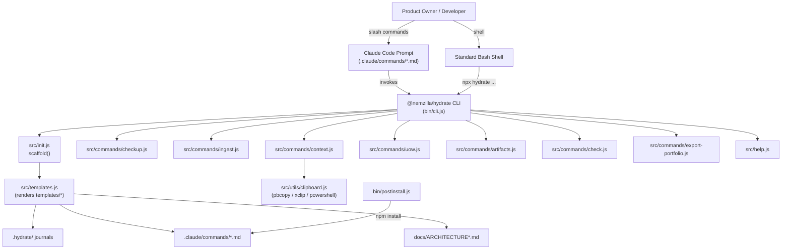

# Architecture - hydrate

## 1. Overall System Architecture

## 2. Technology Stack & Dependencies
- **Runtime**: Node.js (CommonJS modules).
- **CLI Engine**: `bin/cli.js` — hand-rolled argument routing (no external CLI framework), dispatching to `src/commands/*.js`.
- **Provisioning**: `src/init.js` (scaffold on `hydrate init`) and `bin/postinstall.js` (zero-touch scaffold of `.claude/commands/` on `npm install`), both rendering from `templates/` via `src/templates.js`.
- **Templating**: `src/templates.js` — minimal `{{KEY}}` placeholder substitution, zero-dependency.
- **OS Integration**: `src/utils/clipboard.js` — native process spawns (`pbcopy`, `xclip`, `powershell.exe`), no external clipboard package.
- **Testing**: Node's built-in `node:test` + `node:assert/strict` runner (`npm test`), zero-dependency.
- **Host Integration**: Claude Code slash commands (`.claude/commands/*.md`) — thin frontmatter-driven prompt wrappers that shell out to the `hydrate` CLI, keeping interactive and headless execution identical.
