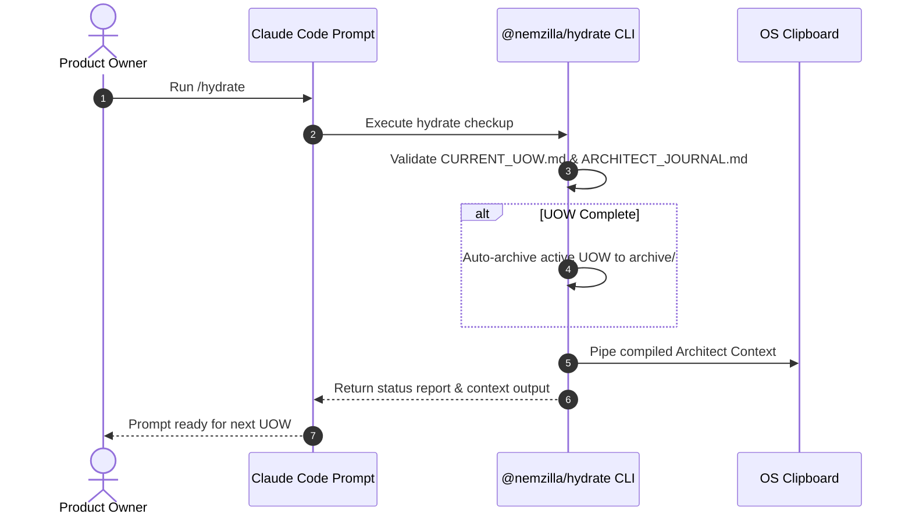
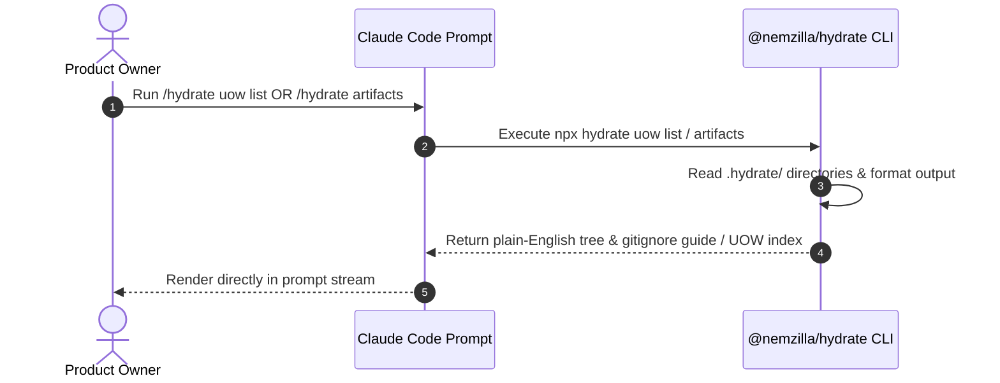

# Architecture Journal — @nemzilla/hydrate

This document captures historical design sessions, decision trade-offs, workflow sequence diagrams, and technology rationales across project milestones.

---

## [2026-09-01] Architectural Baseline: UOW-HYDRATE-01 through UOW-HYDRATE-10

### 1. Technology & Design Decisions Log

| Decision | Selected Choice | Alternative Considered | Rationale & Trade-offs |
| :--- | :--- | :--- | :--- |
| **CLI / Host Communication Interface** | Thin Frontmatter Slash Commands (`.claude/commands/*.md`) | Custom CC Extensions / Complex Plugins | Keeps CC prompt wrapper zero-overhead. Commands invoke standard `npx hydrate` CLI verbs under the hood, ensuring identical execution in headless/CI and interactive CC prompts. |
| **Package Provisioning Model** | `postinstall` hook via `process.env.INIT_CWD` | Manual scaffolding command (`hydrate init`) | Achieves zero-touch setup upon `npm i @nemzilla/hydrate`. Uses `INIT_CWD` guarded against `INIT_CWD === PWD` so internal workspace dev/dogfooding remains clean. |
| **OS Clipboard Integration** | Native process spawns (`pbcopy`, `powershell.exe`, `xclip`) | External npm packages (e.g., `clipboardy`) | Keeps runtime bundle dependency-free. Spawns fail gracefully in TTY-less or headless environments without throwing process crashes. |
| **Non-Interactive Execution in Slash Wrappers** | Automatically pass `--yes` flag in slash commands | Interactive prompts in terminal | TTY prompts freeze or fail when executed via non-interactive Claude Code tool calls. Auto-confirming actions via `--yes` enables unattended zero-touch session execution. |

### 2. Workflow Sequence Diagrams

#### Master `/hydrate` Boot & Sync Sequence

#### In-Prompt UOW & Artifact Inspection

### 3. Key Architectural Wisdom & Gotchas
* **Command Dispatch Case Sensitivity**: CLI routing uses exact string matching for speed and safety. Alias routes (like `lfg`) are intercepted in isolated pre-dispatch logic to prevent unintended globally case-insensitive command behaviors.
* **Scaffold Boundary Rules**: Standard onboarding tools (`checkup`, `ingest`, `context`, `help`) are provisioned automatically via `src/init.js`. Easter-egg or experimental commands are withheld from the default auto-scaffold list to keep default repo footprints minimal.

---

## /hydrate command flow

Terminal                        Claude Code                        Architect Chat
────────                        ───────────                        ──────────────
cd carboyz -> claude  ───>  Run /hydrate  ─────── (Cmd+V / Paste) ───────> Paste Context
                                   │
                    ┌──────────────┴──────────────┐
                    ▼                             ▼
         [Hydrates CC Context]        [Copies Architect Context
                                         to OS Clipboard]

